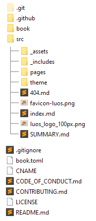
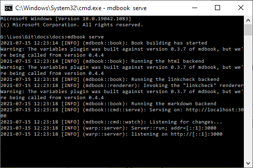

<a href="https://luos.io"></a>


[](https://luos.io)
[](https://github.com/Luos-io/Luos/blob/master/LICENSE)
[](https://www.reddit.com/r/Luos)
[](https://twitter.com/intent/tweet?text=Unleash%20electronic%20devices%20as%20microservices%20thanks%20to%20Luos&https://luos.io&via=Luos_io&hashtags=embeddedsystems,electronics,microservices,api)
[](https://www.linkedin.com/sharing/share-offsite/?url=https%3A%2F%2Fgithub.com%2Fluos-io)

# What and why Luos? :bulb:

We started designing Luos with the conviction that building electronic systems should be made easier than it is today. The majority of development time should be spent on designing the applications and behaviors instead of on complex and time-and-money-eating technicalities. To give a simple example, adding a new sensor (for example a distance sensor) to an electronic device in conception should not take more than a few minutes. So you can try, test and quickly iterate on a project to quickly design what users truly want.

Luos works like a [microservice architecture](https://en.wikipedia.org/wiki/Microservices) in the software world, and a [distributed operating system](https://en.wikipedia.org/wiki/Distributed_operating_system): it encapsulates any software or hardware function to make it communicate and work with any other encapsulated service, however it was developed, either on bare metal or on top of an embedded OS.

This repository contains the Luos library that you will need to include in your software projects. To correctly configure your hardware, it should be used in conjunction with the [LuosHAL project](https://github.com/Luos-io/LuosHAL).

Watch this video for additional details:

<a href="https://youtu.be/xQe3z0M_FE8"></a>

## Unfamiliar with Luos?

→ You can start by reading the [Basics](https://docs.luos.io/pages/luos-technology/basics/basics.html) page.

## You want to tune your device's behavior?

→ Luos provides a [Demonstration board](https://docs.luos.io/pages/tutorials/demo-boards/luos-demo-boards.html) and [Example demonstration boards](https://github.com/Luos-io/Examples/tree/master/Hardware). You can use them as example or to develop your own project.
.

→ You can make your own embedded [Luos apps](https://docs.luos.io/pages/luos-technology/services/service_api.html).

→ You can control your devices through a [Gate](https://docs.luos.io/pages/tools/gate.html) service using [Pyluos](https://docs.luos.io/pages/tools/pyluos.html).

If you have questions about a specific topic, you can refer or ask it on the [Luos' subreddit](https://www.reddit.com/r/Luos). And if you have suggestions about this documentation, don't hesitate to create pull requests.

## Don't hesitate to read [our documentation](https://docs.luos.io), or to post your questions/issues on the [Luos' subreddit](https://www.reddit.com/r/Luos/). :books:
If you have questions about a specific topic, you can refer or ask it on the [Luos' Forum](https://community.luos.io/). And if you have suggestions about this documentation don't hesitate to create pull requests.


# Install/update Rust and mdBook

The Luos's documentation is hosted on GitHub Pages and runs with mdBook:
    - Docs is written in markdown
    - Server is ran by Rust
    - The sources are versioned with GitHub

Follow these steps to modify the documentation:

- Download and install Rust: [https://www.rust-lang.org/tools/install](https://www.rust-lang.org/tools/install) (at least 1.35) and Cargo [https://doc.rust-lang.org/cargo/commands/cargo-install.html](https://doc.rust-lang.org/cargo/commands/cargo-install.html)
- For Windows, download and install [Visual Studio C++ Community](https://visualstudio.microsoft.com/fr/vs/features/cplusplus/)
- In a Shell / terminal (in admin mode for Windows):

```bash
rustup update
cargo install mdbook
cargo install -f mdbook-variables
cargo install mdbook-linkcheck
```

- Update PATH with a line “%USERPROFILE%\.cargo\bin”

More information: <a href="https://rust-lang.github.io/mdBook/index.html" target="_blank">Official mdBook documentation</a>


# Modify and view docs locally

## Docs’s architecture

Documentation’s source is organized as below. Most modification of docs’ content is made in pages folder.



- **.github:** Contains workflow files for GitHub action (compiling the markdown sources into an HTML static website) and issue templates.
- **book:** HTML static local website generated by mdbook serve. This folder is local only, and thus included in *.gitignore* file.
- **src:** All the sources for the documentation.
- **_assets:** Contains the custom CSS files and the images.
- **pages:** Contains the pages in markdown. Each folder is a category for the left menu.
- **theme:** Contains the original CSS and the file *index.hbs*. This file is the general template for every page in the documentation.
- **index.md:** Index page of the documentation.
- **SUMMARY.md:** Contains the tree for the left menu. Any modification here would reflect on this menu.
- **book.toml:** Contains the parameters for the documentation. The *[preprocessor.variables.variables]* category contains the variables for the current pyluos and luos versions: *last_version_pyluos* and *last_version_luos*.

## Git

Git must be installed on your computer: [https://git-scm.com/downloads](https://git-scm.com/downloads)

Clone and fetch the docs repository:

```bash
git clone https://github.com/Luos-io/Documentation.git
git fetch --prune
```

You can then do the modification in the local files from no on, but...

**⛔ ...never push your modification on the branches master or main.**

## View modifications locally

You can check how your modification displays on the docs thanks to a local rust server:

```bash
mdbook serve
```



This will generate a preview of the documentation on a localhost page. Open a browser and type the address:

[http://localhost:3000/](http://localhost:3000/)

Each modification of the local source will automatically update the page in the browser so that you can see how your changes will affect the website.

# Publish modification

Once your modifications have been made and visually checked on your browser with the local Rust server, you can commit them and push them in a new branch for review.

**⛔ Never push your modification on the branches *master* or *main*.**

- Fetch the repository
- Commit your modification
- Push them on a **new branch**
- Create a pull request on [https://github.com/Luos-io/Documentation](https://github.com/Luos-io/Documentation) from this new branch.

Once the pull request has been reviewed, you can merge it on *master* or *main*.

GitHub actions have been set in order to compile the docs after it's been pushed to *master* or *main*. The resulting compiled documentation in HTML is deployed on an isolated branch called *gh-pages*. No modification should ever be pushed on this branch.   

---

## Don't hesitate to read [our documentation](https://docs.luos.io), or to post your questions/issues on the [Luos' subreddit](https://www.reddit.com/r/Luos/). :books:

[](https://www.reddit.com/r/Luos)
[](https://docs.luos.io)
[](https://www.linkedin.com/company/luos)
