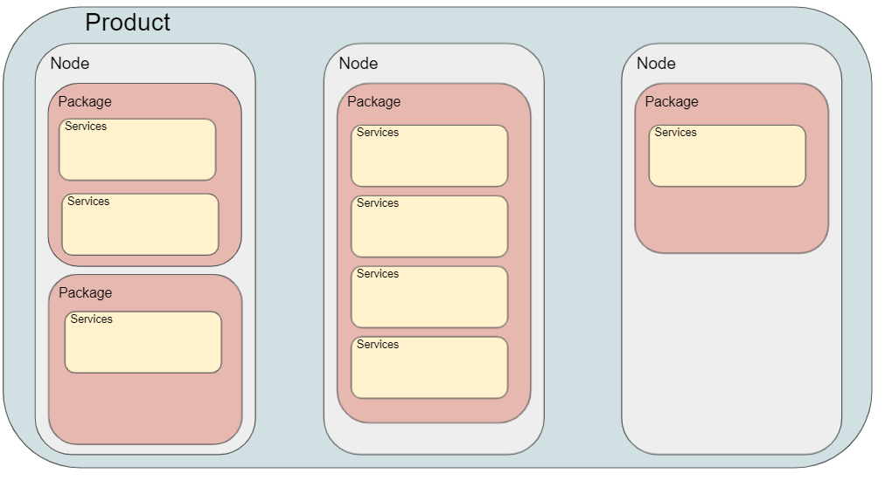

# Code organization

Because Luos allow you to manage your features as sharable code blocs, we organize code in a specific way allowing to easily integrate and share packages from your projects with as little friction as possible.

### Luos Levels

We define different level on the embedded code corresponding to different level of information needed across your entire product.

| Level | Description |
| :---: | :---: |
| Product | A node or a set of nodes that communicate with each other. This is the place were you will have the configurations and information intended for all your boards. |
| Node | This is the board code. This is your actual Eclipse, Platformio, IAR, or any other project. |
| Package | A sharable folder containing code files managing one or more services. |
| Service | Luos services can be Drivers or Apps. Each service can follow Luos profiles to be standard but it can be custom too. |



### Product code organization with Luos

```AsciiDoc
 Project
  │
  ├─── product_config.h
  ├─── Node_1
  │    ├─── node_config.h
  │    ├─── main.c
  │    ├─── main.h
  │    ├─── Package_1
  │    │     ├─── package_1.c
  │    │     └─── package_1.h
  │    └─── Package_2
  │          ├─── package_2.c
  │          └─── package_2.h
  ├─── Node_2
  │    ├─── node_config.h
  │    ├─── main.c
  │    ├─── main.h
  │    └─── Package_3
  │          ├─── package_3.c
  │          └─── package_3.h
  │
  └─── Node_3
       ├─── node_config.h
       ├─── main.c
       ├─── main.h
       ├─── Package_4
       │     ├─── package_4.c
       │     └─── package_4.h
       ├─── Package_5
       │     ├─── package_5.c
       │     └─── package_5.h
       └─── Package_6
             ├─── package_6.c
             └─── package_6.h

```


- **Product level**

    **product_config.h**: this file describes the general configuration for the product, such as Baudrate, timeout duration, etc. It also groups the list of custom types, profiles, and commands that allow services to communicate together. This folder is the same for all the nodes of the same product and should be included at the node level.

- **Node level**

    **node_config.h**: this file describes the configuration of the board Pinout, USART for communication, Timer, and DMA. It also configures the buffer size for Luos communication and the number of tasks.
    **main.c/.h**: The main files for the node that call luos.h, initialize and call the package (all the different Service_Init, Service_Loop).

- **Package level**

    **package.c/.h**: Contains the Service_Init, Service_Loop, and Service_Msg_Handler. In these files, you can create, with Luos API, services dedicated to your function.

- **Service level**
    Use Luos API and Service Profile on your package code to create a standard or a custom service that anybody can use.

### Where is Luos?

Luos Library is used at the node level. You will need to init Luos and call a loop function on your main to be able to use the Luos API on your packages.


