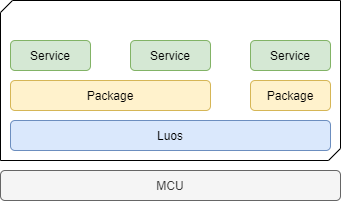

# Architecture

### Luos Levels

| Level | Description |
| :---: | :---: |
| Product | A node or a set of nodes that communicate with each other through Luos and form a complete product. |
| Node | MCUs executing one or more packages' code. |
| Package | A sharable folder containing cross-platform code files managing one or more services. |
| Service | Luos services can be Drivers or Apps. Each service can follow Luos template and Luos list of commands but it can be custom too. |


### Product architecture with Luos

```AsciiDoc
 Project
  │
  ├─── Product_config.h
  ├─── Node 1
  │    ├─── Node_config.h
  │    ├─── Main.c
  │    ├─── Main.h
  │    ├─── container 1
  │    │     ├─── container_1.c
  │    │     └─── container_1.h
  │    └─── container 2
  │          ├─── container_2.c
  │          └─── container_2.h
  ├─── Node 2
  │    ├─── Node_config.h
  │    ├─── Main.c
  │    ├─── Main.h
  │    └─── container 3
  │          ├─── container_3.c
  │          └─── container_3.h
  │
  └─── Node 3
       ├─── Node_config.h
       ├─── Main.c
       ├─── Main.h
       ├─── container 4
       │     ├─── container_4.c
       │     └─── container_4.h
       ├─── container 5
       │     ├─── container_5.c
       │     └─── container_5.h
       └─── container 6
             ├─── container_6.c
             └─── container_6.h

```


- **Product level**

    **Product_config.h**: this file describes the general configuration for the product, such as Baudrate, timeout duration, etc. It also groups the list of custom types, profiles, and commands that allow services to communicate together. This folder is the same for all the nodes of the same product and should be included at the node level.

- **Node level**

    **Node_config.h**: this file describes the configuration of the board Pinout, USART for communication, Timer, and DMA. It also configures the buffer size for Luos communication and the number of tasks.
    **Main.c/.h**: The main files for the node that call luos.h, initialize and call the package (all the different Service_Init, Server_Loop).

- **Package level**

    **Package.c/.h**: Contains the Service_Init, Service_Loop, and Service_Msg_Handler. In these files, you can create, with Luos API, services dedicated to your function.

- **Service level**
    Use Luos API and Service Profile to create a standard or a custom service that anybody can use.

### Where is Luos?

Luos Library is used at the node level.


